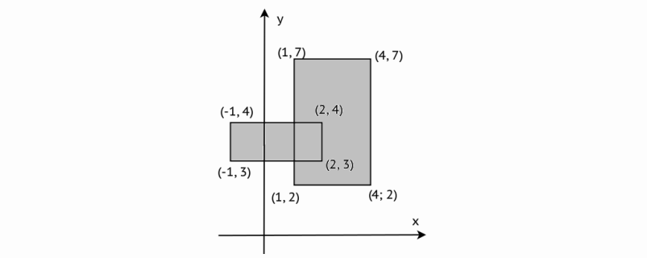

# I4-shootingRangeLevel-5

|Имя входного файла|Имя выходного файла|Ограничение по времени|Ограничение по памяти|
|-|-|-|-|
|стандартный ввод|стандартный вывод|2 секунды|64 мегабайта|

Даны два прямоугольника.
Координаты вершин первого прямоугольника — (1, 7), (4, 7), (4, 2), (1, 2).
Координаты вершин второго прямоугольника — (−1, 3), (−1, 4), (2, 4), (2, 3).
Дана точка (X, Y). Напишите программу, которая проверит, что точка находится хотя бы в одном прямоугольнике. Считается, что точки на границах находятся внутри прямоугольника.

### Формат входных данных
С клавиатуры вводится два целых числа X и Y. Числа не превосходят по модулю 105.
### Формат выходных данных
Требуется вывести «1», если точка попадает в хотя бы один прямоугольник, и «0», если точка не попадает ни в один из них.
### Примеры
|входные данные|выходные данные|
|-|-|
|3 1|0|
|0 3|1|
